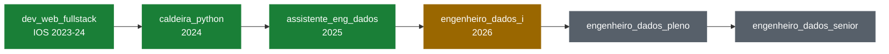

<h1 align="center">Henrike Pajares Braga</h1>

<p align="center">
  
</p>

<p align="center">
  <a href="https://www.linkedin.com/in/henrikebraga/">LinkedIn</a> ·
  <a href="https://henrike-pb.github.io">Portfólio</a> ·
  <a href="mailto:pajaresbragahenrike@gmail.com">E-mail</a>
</p>

## ▶ DAG run: `henrike_profile`

Atuo nos projetos de dados da Appmax: serviços backend em Python, fluxos orientados a eventos na AWS, integrações com parceiros e LLMs, e a camada de dados que sustenta esses produtos.

```text
[2026-09-26 09:00:00] INFO  dag_id=henrike_profile      state=running
[2026-09-26 09:00:01] INFO  task=extract_experience     "Engenheiro de Dados I · Appmax"
[2026-09-26 09:00:02] INFO  task=extract_education      "ADS · UNISINOS  |  alumni Geração Caldeira"
[2026-09-26 09:00:03] INFO  task=transform_skills       [serviços de dados, event-driven, integrações, LLMs]
[2026-09-26 09:00:04] WARN  task=learning               backlog=5 livros + trilhas  (ver learning_pipeline ↓)
[2026-09-26 09:00:05] INFO  task=load_career            proximo_passo="pleno"  state=queued
```

## 🔁 Graph view: `carreira`



<sub>🟩 success · 🟨 running · ⬜ queued</sub>

## 🧩 Tasks

| task_id | o que faz |
|---|---|
| `data_services` | Serviços backend e APIs em Python que sustentam produtos de dados |
| `event_driven` | Fluxos assíncronos com Lambda, SQS, SNS e EventBridge: filas, DLQ e reprocessamento |
| `integrations` | Integrações com parceiros e APIs externas, como a WhatsApp Business Platform da Meta |
| `llm_flows` | Fluxos que integram LLMs, com dados e contexto confiáveis |
| `data_layer` | Modelagem, migrations e camadas de serving em PostgreSQL, Redis e Redshift |
| `pipelines` | ETL com PySpark e Airflow, do data lake ao data warehouse |
| `operate` | Investigação de incidentes, post-mortems e documentação dos fluxos que construo |
| `ship` | Infraestrutura como código, containers e CI/CD com gates de segurança |

## 🗂️ Data catalog

```sql
SELECT camada, ferramentas FROM henrike.stack ORDER BY camada;
```

| camada | | ferramentas |
|---|---|---|
| `linguagens` |  | Python · SQL |
| `backend_python` |     | FastAPI · Pydantic · SQLAlchemy · Alembic · pytest |
| `aws` |  | Lambda · SQS · SNS · EventBridge · API Gateway · S3 · EC2 · ECS Fargate · CloudWatch |
| `bancos_de_dados` |     | RDS / Aurora PostgreSQL · Redshift · DynamoDB · Redis · MySQL |
| `processamento` |    | PySpark · Databricks · Pandas · EMR Serverless |
| `orquestracao` |  | Airflow |
| `integracoes_ia` |   | WhatsApp Business API (Meta) · REST · Webhooks · LLMs |
| `devops` |      | Terraform · Docker · GitLab CI · Trivy · Git |
| `ferramentas` |    | VS Code · DataGrip · Jupyter |

<sub>(9 rows)</sub>

## 📚 Backlog: `learning_pipeline`

<sub><code>schedule="um livro por vez"</code> · cada leitura roda em paralelo com uma trilha de cursos da mesma área · clique no título para ver o livro</sub>

| janela | livro | trilha em paralelo | state |
|---|---|---|---|
| out–nov 2026 | [Fundamentos de Engenharia de Dados](https://www.amazon.com.br/Fundamentos-Engenharia-Dados-Construa-Sistemas/dp/8575228765) (Reis & Housley) | Orquestração com Airflow | ⏭️ next |
| dez 2026–jan 2027 | [Arquitetura Limpa](https://www.amazon.com.br/Arquitetura-Limpa-Artes%C3%A3o-Estrutura-Software/dp/8550804606) (Robert C. Martin) | Python avançado, testes e SOLID | ⬜ queued |
| fev–abr 2027 | [Projetando Aplicações com Uso Intensivo de Dados, 2ª ed.](https://www.amazon.com.br/Projetando-Aplica%C3%A7%C3%B5es-com-Intensivo-Dados/dp/6583913062) (Kleppmann & Riccomini) | PostgreSQL, mensageria e microsserviços | ⬜ queued |
| mai–jun 2027 | [Padrões de Design de Engenharia de Dados](https://www.amazon.com.br/Padr%C3%B5es-Design-Engenharia-Dados-engenharia/dp/8575229664) (Konieczny) | FastAPI e padrões de API HTTP | ⬜ queued |
| jul–set 2027 | [Engenharia de IA](https://www.amazon.com.br/Engenharia-IA-Construindo-aplica%C3%A7%C3%B5es-funda%C3%A7%C3%A3o/dp/8575229966) (Chip Huyen) | Agentes de IA e MCP | ⬜ queued |
| contínuo | — | Docker, observabilidade, OpenTelemetry e inglês técnico | 🟨 running |
| 2027 | — | Certificação AWS (em preparação) | 🟨 running |

## 🎓 Formação

```sql
SELECT curso, instituicao, periodo FROM henrike.formacao ORDER BY inicio;
```

| curso | instituição | período |
|---|---|---|
| Desenvolvimento Web Full Stack | Instituto da Oportunidade Social (atual Instituto Percorre) | ✅ 2023–2024 |
| Geração Caldeira, trilha Python | Instituto Caldeira | ✅ 2024 · alumni |
| Análise e Desenvolvimento de Sistemas | UNISINOS | 🔄 cursando |

<sub>(3 rows)</sub>

---

```text
$ airflow dags trigger henrike_profile --conf '{"visitante": "você"}'
[INFO] task=register_visit     state=success
[INFO] Marking run as SUCCESS. Obrigado pela visita! 👋
```

<p align="center">
  
  
  
</p>
